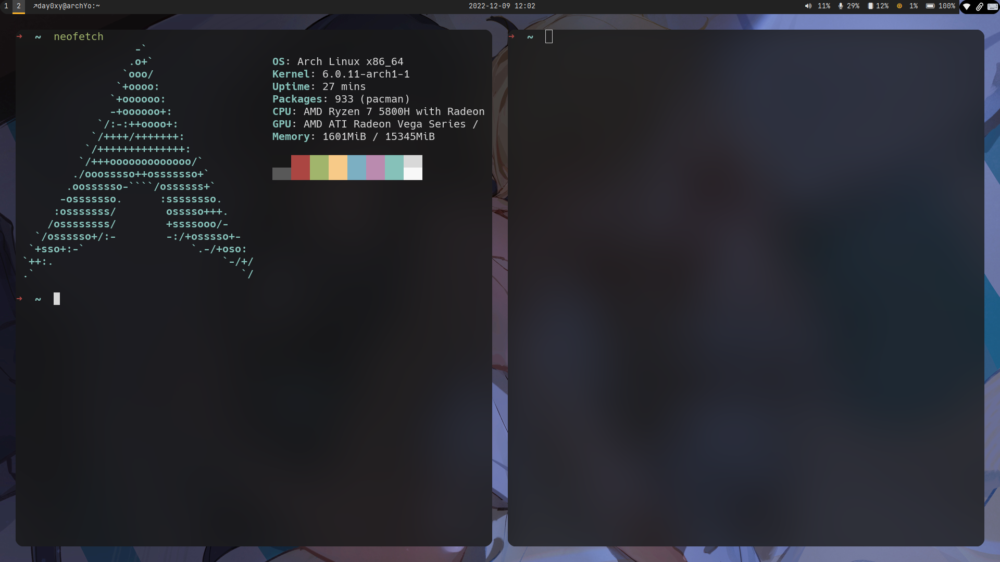

# i3-config  :)


| [Install](#Install)        |
| -------------------------- |
| [Screenshot](Screenshot)   |
| [Shortcuts](Shortcuts)     |
| [Problem fix](Problem fix) |

```
Pure i3-gaps with polybar,without DE.
```

```
Modified from someone's dotfiles 
```

```
:)
```

with round  corners and terminal blur,screenshots are following


## Install

To install,following the steps:

* move `.*sh` to your $HOME
* move `config folders` to $HOME/.config/
* move `.wallpaper and /wallpaper_nsfw` to $HOME

and:

copy `content` of `picom.conf` to `/etc/xdg/picom.conf`


## Softwares

for archlinux user

```
yay -S i3-gaps picom breeze-icons lxappearance-gtk3 qt5ct nerd-fonts-complete

yay -S termite feh rofi ranger ueberzug dolphin  polybar twmn-git xidlehook

yay -S betterlockscreen networkmanager-dmenu-git  imagemagick  xfce4-power-manager xfce4-clipman-plugin

yay -S polkit-kde-agent  ark
```


## Screenshot




## Shortcuts

| ctrl+$mod+s | SFW mode  |
| ----------- | --------- |
| ctrl+$mod+n | NSFW mode |
| $mod+return | terminal  |
| alt+e       | dolphin   |

two mode,check wallpaper folders

##  Problem fix

some problems fix

### 1.terminal font

```
yay -S ttf-hack
```

### 2.polybar

[miscphone config]

check `.config/polybar/config`

```
[module/mic-volume]
type = custom/script
interval = 1
format = Mic:<label>
exec = bash ~/.config/polybar/mic-volume/mic-volume.sh show-vol alsa_input.pci-0000_04_00.6.analog-stereo

; Control actions (using pactl)
; Example supplying the name of the source
click-left = bash ~/.config/polybar/mic-volume/mic-volume.sh mute-vol alsa_input.pci-0000_04_00.6.analog-stereo
; Example supplying the index of the source
scroll-up = bash ~/.config/polybar/mic-volume/mic-volume.sh inc-vol 
; Example leaving the MICROPHONE_NAME blank and using the default source
scroll-down = bash ~/.config/polybar/mic-volume/mic-volume.sh dec-vol 
```

you can delete `alsa_input.pci-0000_04_00.6.analog-stereo`  to use default 


or:

```
pactl list | grep input 
```

get you device id

```
Name: alsa_input.pci-0000_04_00.6.analog-stereo
```

### 3.dolphin inner terminal

```
The default terminal is konsole,but it has white border,now follow steps to change to termite
```

`check` https://wiki.archlinux.org/title/Dolphin#Open_terminal to change it.

### 4.dolphin icons 

Ways to change dolphin icon themes

```
yay -S qt5ct
```

```
$sudoedit /etc/environment
```

add these

```
export QT_QPA_PLATFORMTHEME="qt5ct"
```

or

add `export QT_QPA_PLATFORMTHEME="qt5ct"` to ~/.xprofile

```
reboot
```


```
yay -S flat-remix
```


open qt5ct with rofi


you can change icon theme through the GUI 


### 5.touchpad

#### 

```
yay -S xf86-input-synaptics
```

```
sudoedit /etc/X11/xorg.conf.d/70-synaptics.conf
```


```
Section "InputClass"
        Identifier "touchpad catchall"
        Driver "synaptics"
        MatchIsTouchpad "on"

        Option "TapButton1" "1"            #单指敲击产生左键事件
        Option "TapButton2" "3"            #双指敲击产生中键事件

        Option "VertEdgeScroll" "on"       #滚动操作：横向、纵向、环形
        Option "VertTwoFingerScroll" "on"
        Option "VertScrollDelta"          "-111"	#natural scrolling
        Option "HorizScrollDelta"         "-111"
        Option "HorizEdgeScroll" "on"		
        Option "HorizTwoFingerScroll" "on"
        Option "CircularScrolling" "on"  
        Option "CircScrollTrigger" "2"

        Option "EmulateTwoFingerMinZ" "40" #精确度
        Option "EmulateTwoFingerMinW" "8"
        Option "CoastingSpeed" "20"        #触发快速滚动的滚动速度

        Option "PalmDetect" "1"            #避免手掌触发触摸板
        Option "PalmMinWidth" "3"          #认定为手掌的最小宽度
        Option "PalmMinZ" "200"            #认定为手掌的最小压力值
EndSection

```

### 6.systemtray icon

1.install `lxappearance-gtk3` and `qt5ct`


2.download your icon the to `~/.icons/`


3.open the two programs to set


4.set icon size

edit polybar/config   

```
tray-maxsize = 22
```

 
