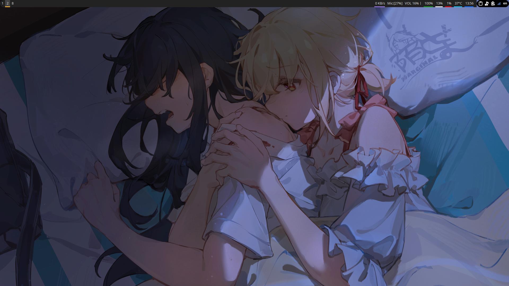
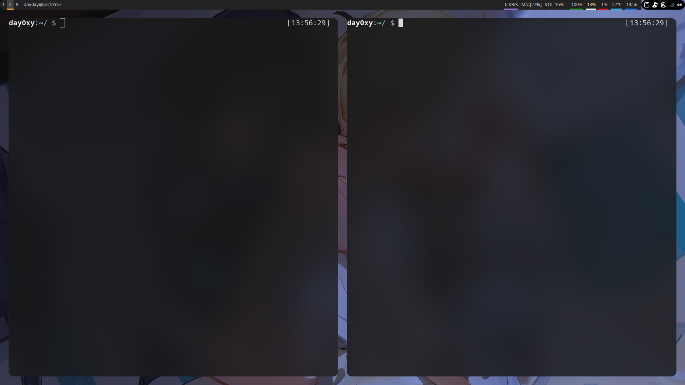
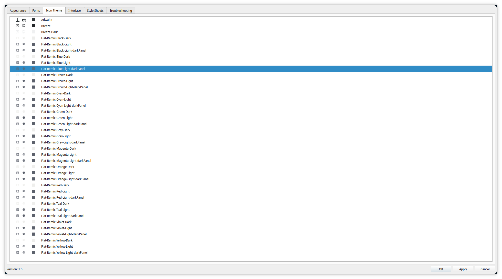

# i3-config  :)


| [Install](#Install)        |
| -------------------------- |
| [Screenshot](Screenshot)   |
| [Shortcuts](Shortcuts)     |
| [Problem fix](Problem fix) |

```
Pure i3-gaps with polybar,without DE.
```

```
Modified from someone's dotfiles 
```

```
:)
```

with round  corners and terminal blur,screenshots are following


softwares you should install(if ArchLinuxuser):

i prefer `yay`:

```
yay -S i3-gaps picom breeze-icons ark nerd-fonts-complete 

yay -S termite feh rofi ranger ueberzug dolphin  polybar twmn-git xidlehook

yay -S betterlockscreen networkmanager-dmenu-git  imagemagick  xfce4-power-manager xfce4-clipman-plugin

yay -S xfce-polkit-git or   	polkit-kde-agent   qt5ct   ark

for fcitx5:

yay -S  fcitx5-im     fcitx5-chinese-addons fcitx5-pinyin-moegirl  fcitx5-pinyin-zhwiki
```

check .config/i3/config to see  what you also need to install


## Install

To install,following the steps:

* move `.*sh` to your $HOME
* move `config folders` to $HOME/.config/
* move `.wallpaper and /wallpaper_nsfw` to $HOME

and:

copy `content` of `picom.conf` to `/etc/xdg/picom.conf`


## Screenshot







bar:


is it really simple?

## Shortcuts

| ctrl+$mod+s | SFW mode  |
| ----------- | --------- |
| ctrl+$mod+n | NSFW mode |
| $mod+return | terminal  |
| alt+e       | dolphin   |

two mode,check wallpaper folders

##  Problem fix

some problems fix

### 1.terminal font

```
yay -S ttf-hack
```

### 2.polybar

[miscphone config]

check `.config/polybar/config`

```
[module/mic-volume]
type = custom/script
interval = 1
format = Mic:<label>
exec = bash ~/.config/polybar/mic-volume/mic-volume.sh show-vol alsa_input.pci-0000_04_00.6.analog-stereo

; Control actions (using pactl)
; Example supplying the name of the source
click-left = bash ~/.config/polybar/mic-volume/mic-volume.sh mute-vol alsa_input.pci-0000_04_00.6.analog-stereo
; Example supplying the index of the source
scroll-up = bash ~/.config/polybar/mic-volume/mic-volume.sh inc-vol 
; Example leaving the MICROPHONE_NAME blank and using the default source
scroll-down = bash ~/.config/polybar/mic-volume/mic-volume.sh dec-vol 
```

you can delete `alsa_input.pci-0000_04_00.6.analog-stereo`  to use default 


or:

```
pactl list | grep input 
```

get you device id

```
Name: alsa_input.pci-0000_04_00.6.analog-stereo
```

### 3.dolphin inner terminal

```
The default terminal is konsole,but it has white border,now follow steps to change to termite
```

`check` https://wiki.archlinux.org/title/Dolphin#Open_terminal to change it.

### 4.dolphin icons 

Ways to change dolphin icon themes

```
yay -S qt5ct
```

```
$sudoedit /etc/environment
```

add these

```
export QT_QPA_PLATFORMTHEME="qt5ct"
```

or

add `export QT_QPA_PLATFORMTHEME="qt5ct"` to ~/.xprofile

```
reboot
```


```
yay -S flat-remix
```


open qt5ct with rofi


you can change icon theme through the GUI 


