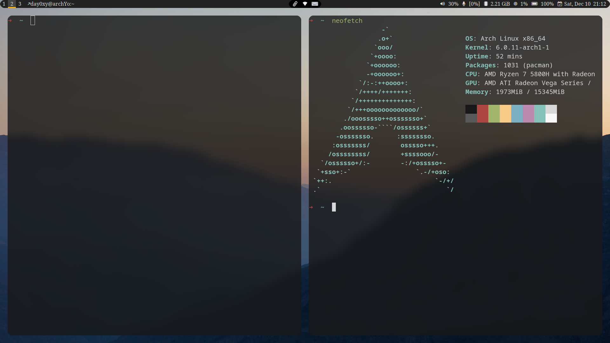

# i3-config  :)


| [Install](#Install)         |
| --------------------------- |
| [Screenshot](Screenshot)    |
| [Shortcuts](Shortcuts)      |
| [Problem fix](#Problem fix) |

```
Pure i3-gaps with polybar,without DE.
```

```
Modified from someone's dotfiles 
```

```
:)
```

with round  corners and terminal blur,screenshots are following


## Install

To install,following the steps:

* move `scripts/.*sh` to your $HOME
* move `config/folders` to $HOME/.config/
* move `.wallpaper and .wallpaper_nsfw` to $HOME

and:

copy `content` of `picom.conf` to `/etc/xdg/picom.conf`


## Softwares

for archlinux user

```
yay -S i3-gaps picom breeze lxappearance-gtk3 qt5ct nerd-fonts-complete

yay -S termite feh rofi ranger ueberzug dolphin  polybar twmn-git xidlehook

yay -S betterlockscreen   imagemagick  xfce4-power-manager xfce4-clipman-plugin

yay -S polkit-kde-agent  ark autotiling flat-remix-gtk
```


## Screenshot





## Shortcuts

| ctrl+$mod+s  | SFW mode         |
| ------------ | ---------------- |
| ctrl+$mod+n  | NSFW mode        |
| shift+$mod+c | change wallpaper |
| $mod+return  | terminal         |
| alt+e        | dolphin          |

two mode,check wallpaper folders

##  Problem fix

some problems fix

### 1.terminal font

```
yay -S ttf-hack
```

### 3.dolphin inner terminal

```
vim .config/kdeglobals
```

add

```
[General]
TerminalApplication=termite
```

### 4.dolphin icons 

Ways to change dolphin icon themes

```
yay -S qt5ct
```

```
$sudoedit /etc/environment
```

add these

```
export QT_QPA_PLATFORMTHEME="qt5ct"
```

or

add `export QT_QPA_PLATFORMTHEME="qt5ct"` to ~/.xprofile

```
reboot
```


```
yay -S flat-remix
```


open qt5ct with rofi


you can change icon theme through the GUI 


### 5.touchpad

#### 

```
yay -S xf86-input-synaptics
```

```
sudoedit /etc/X11/xorg.conf.d/70-synaptics.conf
```


```
Section "InputClass"
        Identifier "touchpad catchall"
        Driver "synaptics"
        MatchIsTouchpad "on"

        Option "TapButton1" "1"            #tap to click
        Option "TapButton2" "3"            

        Option "VertEdgeScroll" "on"       
        Option "VertTwoFingerScroll" "on"
        Option "VertScrollDelta"          "-111"	#natural scrolling
        Option "HorizScrollDelta"         "-111"
        Option "HorizEdgeScroll" "on"		
        Option "HorizTwoFingerScroll" "on"
        Option "CircularScrolling" "on"  
        Option "CircScrollTrigger" "2"
EndSection

```

### 6.systemtray icon

1.install `lxappearance-gtk3` and `qt5ct`


2.download your icon the to `~/.icons/`


3.open the two programs to set


4.set icon size

edit polybar/config   

```
tray-maxsize = 22
```

###  7.dolphin background

if you like `dark` theme 

when you use  `qt5ct` to change the palette,the dolphin background is white and you can't see the text under icons

to solve it , check the kdeglobals 

```
vim .config/kdeglobals
```

insert these

```
[ColorEffects:Disabled]
ChangeSelectionColor=
Color=56,56,56
ColorAmount=0
ColorEffect=0
ContrastAmount=0.65
ContrastEffect=1
Enable=
IntensityAmount=0.1
IntensityEffect=2

[ColorEffects:Inactive]
ChangeSelectionColor=true
Color=112,111,110
ColorAmount=0.025
ColorEffect=2
ContrastAmount=0.1
ContrastEffect=2
Enable=false
IntensityAmount=0
IntensityEffect=0

[Colors:Button]
BackgroundAlternate=30,87,116
BackgroundNormal=49,54,59
DecorationFocus=61,174,233
DecorationHover=61,174,233
ForegroundActive=61,174,233
ForegroundInactive=161,169,177
ForegroundLink=29,153,243
ForegroundNegative=218,68,83
ForegroundNeutral=246,116,0
ForegroundNormal=252,252,252
ForegroundPositive=39,174,96
ForegroundVisited=155,89,182

[Colors:Complementary]
BackgroundAlternate=30,87,116
BackgroundNormal=42,46,50
DecorationFocus=61,174,233
DecorationHover=61,174,233
ForegroundActive=61,174,233
ForegroundInactive=161,169,177
ForegroundLink=29,153,243
ForegroundNegative=218,68,83
ForegroundNeutral=246,116,0
ForegroundNormal=252,252,252
ForegroundPositive=39,174,96
ForegroundVisited=155,89,182

[Colors:Header]
BackgroundAlternate=42,46,50
BackgroundNormal=49,54,59
DecorationFocus=61,174,233
DecorationHover=61,174,233
ForegroundActive=61,174,233
ForegroundInactive=161,169,177
ForegroundLink=29,153,243
ForegroundNegative=218,68,83
ForegroundNeutral=246,116,0
ForegroundNormal=252,252,252
ForegroundPositive=39,174,96
ForegroundVisited=155,89,182

[Colors:Header][Inactive]
BackgroundAlternate=49,54,59
BackgroundNormal=42,46,50
DecorationFocus=61,174,233
DecorationHover=61,174,233
ForegroundActive=61,174,233
ForegroundInactive=161,169,177
ForegroundLink=29,153,243
ForegroundNegative=218,68,83
ForegroundNeutral=246,116,0
ForegroundNormal=252,252,252
ForegroundPositive=39,174,96
ForegroundVisited=155,89,182

[Colors:Selection]
BackgroundAlternate=30,87,116
BackgroundNormal=61,174,233
DecorationFocus=61,174,233
DecorationHover=61,174,233
ForegroundActive=252,252,252
ForegroundInactive=161,169,177
ForegroundLink=253,188,75
ForegroundNegative=176,55,69
ForegroundNeutral=198,92,0
ForegroundNormal=252,252,252
ForegroundPositive=23,104,57
ForegroundVisited=155,89,182

[Colors:Tooltip]
BackgroundAlternate=42,46,50
BackgroundNormal=49,54,59
DecorationFocus=61,174,233
DecorationHover=61,174,233
ForegroundActive=61,174,233
ForegroundInactive=161,169,177
ForegroundLink=29,153,243
ForegroundNegative=218,68,83
ForegroundNeutral=246,116,0
ForegroundNormal=252,252,252
ForegroundPositive=39,174,96
ForegroundVisited=155,89,182

[Colors:View]
BackgroundAlternate=35,38,41
BackgroundNormal=27,30,32
DecorationFocus=61,174,233
DecorationHover=61,174,233
ForegroundActive=61,174,233
ForegroundInactive=161,169,177
ForegroundLink=29,153,243
ForegroundNegative=218,68,83
ForegroundNeutral=246,116,0
ForegroundNormal=252,252,252
ForegroundPositive=39,174,96
ForegroundVisited=155,89,182

[Colors:Window]
BackgroundAlternate=49,54,59
BackgroundNormal=42,46,50
DecorationFocus=61,174,233
DecorationHover=61,174,233
ForegroundActive=61,174,233
ForegroundInactive=161,169,177
ForegroundLink=29,153,243
ForegroundNegative=218,68,83
ForegroundNeutral=246,116,0
ForegroundNormal=252,252,252
ForegroundPositive=39,174,96
ForegroundVisited=155,89,182
```


